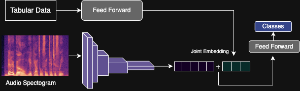
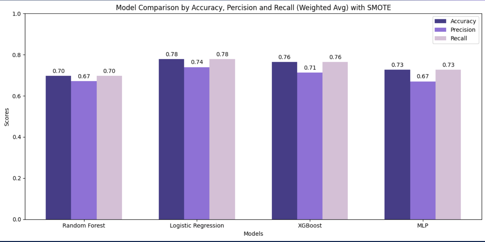
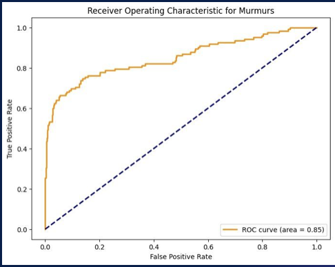
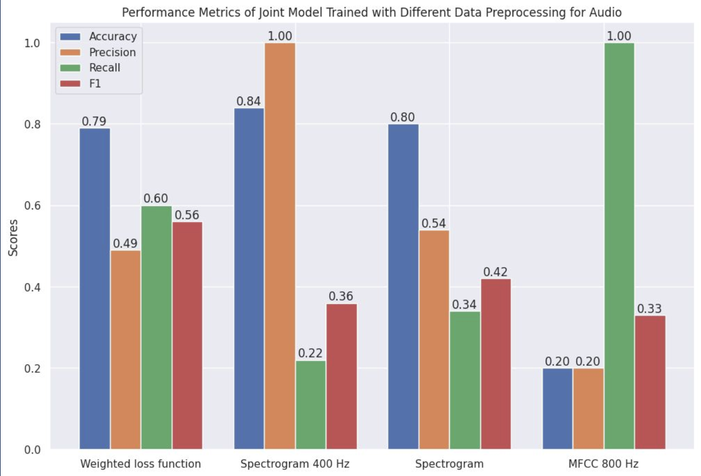

# Heart-murmur-detection

This project is based on the George B. Moody PhysioNet Challenge 2022, which focuses on detecting heart murmurs from phonocardiogram (PCG) recordings and patient records.

Heart disease is a leading cause of morbidity and mortality worldwide, especially in low-resource regions where access to cardiologists and diagnostic tools is limited. Conditions like congenital heart disease and rheumatic fever often go undiagnosed due to a lack of specialists and medical infrastructure.

A Joint Learning Model for heart murmur detection through Phonocardiogram Recordings and time series patient records

## Dataset

The dataset consists of 1568 patients, each with:
- Heart sound recordings from multiple auscultation locations.
- Demographic & clinical data (e.g., age, height, pregnancy status).
- Murmur labels (present, absent, or unknown).
- Outcome labels (normal or abnormal).

## Methodology 

### Tabular Data Processing

- Cleaned missing values (e.g., polynomial regression for weight..etc).
- Encoded categorical variables & handled class imbalance with SMOTE.

Audio Processing
- Converted .wav files into spectrograms & MFCC features.
- Applied low-pass filtering (400Hz & 800Hz) to remove noise.

## Model Architecture 

Experimented with Traditional Machine Learning approached for the tabular data only, and then used a Joint CNN + MLP model combining audio & tabular data. 

 

## Results 

Best Performance was achieved through the Joint Model using 800Hz Filtering 
## Results 

Best Performance was achieved through the Joint Model using 800Hz Filtering  

    
    

<b>Performance Comparison of ML Models (Tabular Data Only) | ROC Curve for Joint Learning (800Hz Filtering)</b>

    

<b>Performance Metrics for Joint Model with Different Data Processing Methods</b>

